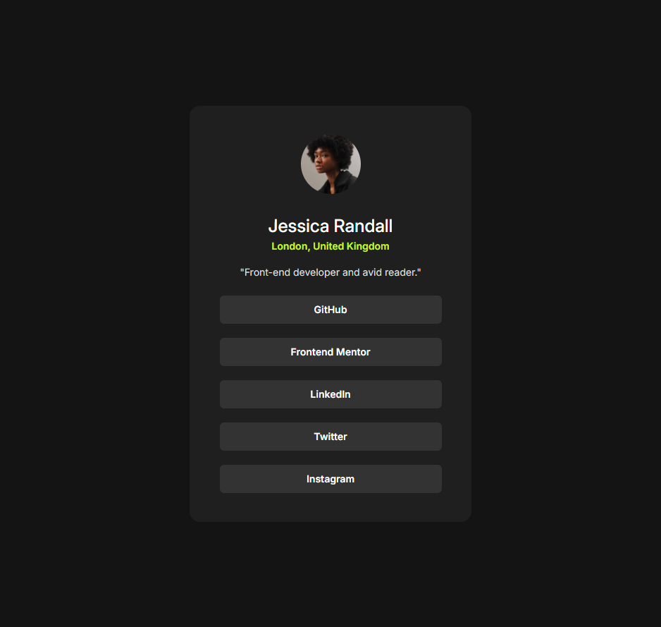

# 🔗 Social Links Profile

My solution to the [Social Links Profile challenge](https://www.frontendmentor.io/challenges/social-links-profile-UG32l9m6dQ) on [Frontend Mentor](https://www.frontendmentor.io) — a sleek, dark-themed profile card with an avatar, bio, and a list of social link buttons.


## ✨ Features

- 👤 Profile card with avatar, name, and location
- 📝 Short bio section — *"Front-end developer and avid reader."*
- 🔘 Five social link buttons: **GitHub, Frontend Mentor, LinkedIn, Twitter, Instagram**
- 🖱️ Hover / active states per the challenge design
- 📱 Responsive, centered dark card layout

## 🛠️ Tech Stack

- HTML5
- CSS3 (Flexbox, custom colors, hover states)

## 📂 Project Structure

```
Social-links-profile/
├── index.html        # Profile card markup
├── style.css         # Dark theme card styles
├── preview.jpg       # Design preview
├── design/           # Design references
└── images/
    ├── avatar-jessica.jpeg
    └── screenshot.png
```

## 🚀 Getting Started

1. Clone the repository
   ```bash
   git clone https://github.com/shena9y/Social-links-profile.git
   ```
2. Open `index.html` in your browser — no build step required.

## 📸 Screenshot



## 📝 License

This project is open source and available under the [MIT License](LICENSE).
